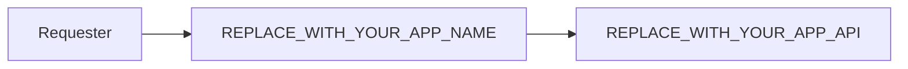

# REPLACE_WITH_YOUR_APP_NAME

## 📘 About

REPLACE_WITH_YOUR_APP_NAME คือ Web Application สำหรับการใช้งานในชีวิตประจำวันทั่วไป เปิดให้บริการแล้ววันนี้

## 📦 Built With

- [x] React JS

## ⚒ Structure



## 📋 Features

- `/` Landing Page
- `/signin` Sign In Page

## 📝 Test Cases

No Data

## ⚙ Get Started

1. Clone project

    ```bash
    git clone {REPLACE_WITH_YOUR_APP_GIT_LINK}
    ```

2. Go to project folder

    ```bash
    cd REPLACE_WITH_YOUR_APP_NAME
    ```

3. Set up environment by command

    ```bash
    yarn

    # or use `npm install`
    ```

4. Run project by command

    ```bash
    # Normal Mode
    yarn start

    # Build Mode
    yarn build
    ```

🌈 CRA Template – Made with ❤️ by Watsize 🌈
